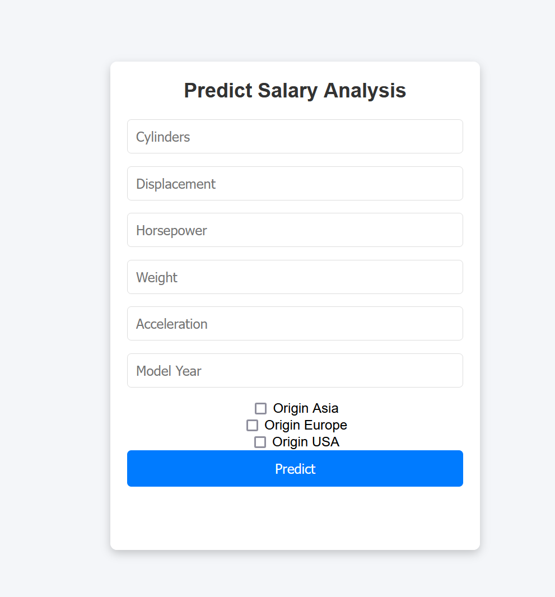

# MPG Car Dataset API

## Overview
This project is a Flask-based web application that serves predictions for miles per gallon (MPG) based on various car features using a machine learning model. The application allows users to input specific characteristics of a car and receive an estimated MPG value.



## Workflow Notebook

The `workflow.ipynb` file serves as the core of our project by presenting the entire decision-making process from a data science perspective. This notebook covers all essential steps, including data importation, cleaning and preprocessing, data analysis, visualization, and the application of machine learning techniques. Furthermore, it details the model training process and the saving of a pipeline, ensuring reproducibility and efficiency in the model deployment. This integrated workflow guarantees that all steps are correctly executed and documented for clear understanding and future enhancement of the project.

## Dataset
The dataset used for training the model is the `mpgcar` dataset, which contains various features of cars, including:
- `cylinders`: Number of cylinders in the car
- `displacement`: Engine displacement
- `horsepower`: Engine horsepower
- `weight`: Weight of the car
- `acceleration`: Acceleration of the car
- `model year`: Year of the car model
- `origin` : country of origin (1: USA, 2 : Europe, 3 : Asia(Japan))

## Installation

### Prerequisites
Make sure you have Python installed (preferably Python 3.7 or later). You will also need `pip` for managing Python packages.

### Clone the Repository
```bash
git clone https://github.com/mart-dore/datascience-portfolio
cd datascience-portfolio
```

### Install Required Packages
You can install the necessary packages using the following command:
```bash
pip install -r requirements.txt
```

## Usage

### Running the Application
1. Make sure your trained model is saved as `model.pkl` in the project directory.
2. Start the Flask application:
   ```bash
   python app.py
   ```
3. Open your web browser and go to `http://127.0.0.1:5000` to access the application.

### Making Predictions
- Fill in the form with the car features.
- Click the "Predict" button to receive the estimated MPG.

### API Endpoint
The application also provides an API endpoint for making predictions directly via JSON.

#### Predict API
- **URL**: `/predict_api`
- **Method**: `POST`
- **Request Format**: JSON
- **Example Request**:
  ```json
  {
      "cylinders": 4,
      "displacement": 120,
      "horsepower": 95,
      "weight": 2500,
      "acceleration": 15,
      "model year": 76,
      "origin_Asia": 0,
      "origin_Europe": 1,
      "origin_USA": 0
  }
  ```
- **Response Format**: JSON
- **Example Response**:
  ```json
  {
      "prediction": 24.5
  }
  ```

## Future Improvements
 - Optimize web app (Errors, styles...)
 - Optimize Machine Learning Model (fine tuning, choice of model, hyperparameters)
